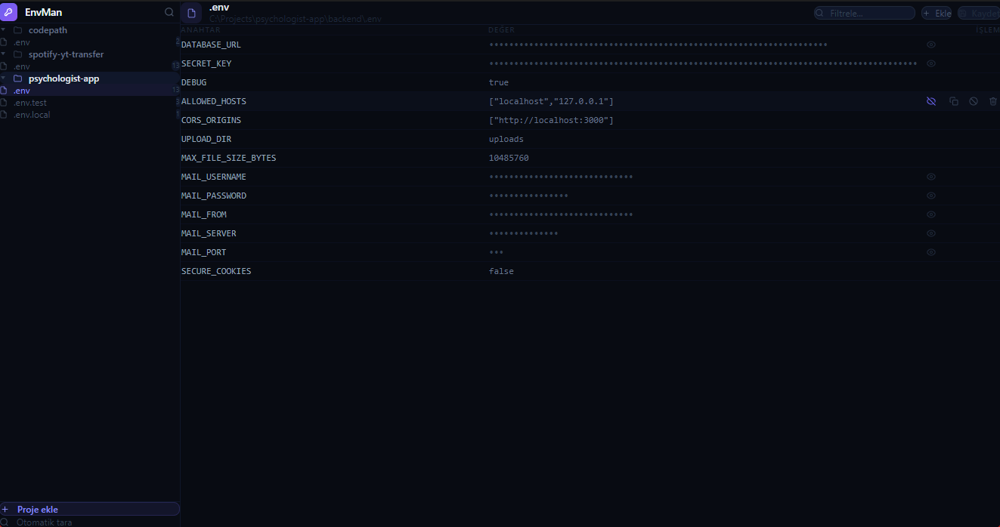

# EnvMan

Geliştiriciler için masaüstü `.env` dosya yöneticisi. **Electron + React + Vite + Tailwind** ile geliştirildi. `.env` dosyalarını yerinde okur ve düzenler.

---



---

## Özellikler

- **Otomatik proje keşfi** — bir ana klasör seç, alt klasörler `.env` dosyaları için otomatik taranır
- **Manuel ekleme** — `.env*` dosyası içeren herhangi bir klasörü ekle
- **Çoklu proje görünümü** — kenar çubuğundan projeler arasında geç
- **Maskelenmiş editör** — gizli değerler varsayılan olarak gizlenir, 👁 ile göster, ⧉ ile kopyala
- **Global arama** — bir anahtar yaz (örn. `DATABASE_URL`) ve tüm projelerde ara
- **Yerinde düzenleme** — değişiklikler doğrudan orijinal `.env` dosyasına yazılır, proje düzenin bozulmaz
- **Klavye navigasyonu** — `↑ ↓` ile sonuçlar arasında gezip `Enter` ile dosyaya atla, `ESC` ile kapat

---

## Kurulum & Çalıştırma

**Gereksinim:** Node.js 20+

```bash
# 1. Repoyu klonla
git clone https://github.com/simalarifoglu/envman.git
cd envman

# 2. Bağımlılıkları yükle
npm install

# 3. Geliştirme modunda başlat
npm run dev

# 4. Production build al
npm run build
```

Production build çıktısı `/release` klasörüne yerleştirilir.

---

## Proje Yapısı

```
envman/
├── electron/
│   ├── main.ts          # Electron ana process — pencere oluşturma
│   ├── preload.ts       # contextBridge — renderer'a window.envman'ı açar
│   ├── ipc.ts           # IPC işleyicileri (dosya okuma/yazma, dialog, pano)
│   ├── scan.ts          # Özyinelemeli .env keşfi
│   └── store.ts         # Kalıcı proje listesi (userData/envman.json)
├── src/
│   ├── shared/
│   │   ├── types.ts     # Ortak TypeScript tipleri
│   │   └── parser.ts    # .env ayrıştırıcı & serileştirici
│   ├── components/
│   │   ├── Sidebar.tsx      # Proje & dosya navigasyonu
│   │   ├── EnvEditor.tsx    # Maskelenmiş anahtar-değer editörü
│   │   └── GlobalSearch.tsx # Projeler arası arama modalı
│   ├── App.tsx
│   ├── main.tsx
│   └── index.css
├── public/
├── package.json
└── vite.config.ts
```

---

## Kullanım

### Proje ekleme

Kenar çubuğundaki **"Proje ekle"** butonuna tıkla → `.env` dosyalarını içeren klasörü seç → dosya ağacı otomatik görünür.

### Otomatik tarama

**"Otomatik tara"** butonuna tıkla → bir ana klasör seç (örn. `C:\projeler`) → EnvMan tüm alt klasörleri tarar ve `.env` dosyası içerenleri otomatik olarak ekler.

### Değer düzenleme

Herhangi bir değere tıklayarak satır içinde düzenle. Değişiklikler araç çubuğunda vurgulanır — diske yazmak için **Kaydet**'e tıkla.

### Maskelenmiş gizli değerler

`secret`, `password`, `token`, `key`, `api`, `auth`, `pwd`, `mail`, `username`, `email`, `url`, `host` veya `server` içeren anahtarlar otomatik olarak maskelenir. Göz ikonuna tıklayarak değeri görebilir, kopyala ikonuna tıklayarak ekranda göstermeden panoya kopyalayabilirsin.

### Global arama

Sol üst köşedeki 🔍 ikona tıkla → herhangi bir anahtar veya değer yaz → tüm takip edilen projelerde sonuçlar belirir → doğrudan o dosyaya atlamak için `Enter`'a bas veya tıkla.

---

## Nasıl Çalışır

- Proje listesi, Electron'un `userData` dizininde `envman.json` olarak saklanır
- `.env` dosyaları **asla kopyalanmaz veya çoğaltılmaz** — EnvMan yalnızca orijinalleri okur/yazar
- Ayrıştırıcı; tırnaklı değerleri, satır içi `#` yorumlarını, devre dışı satırları (`# ANAHTAR=DEĞER`) ve yaygın varyantları destekler: `.env`, `.env.local`, `.env.staging`, `.env.production`

---

## Teknoloji Yığını

| Katman | Teknoloji |
|---|---|
| Masaüstü kabuğu | Electron 30 |
| Arayüz çerçevesi | React 18 + TypeScript |
| Derleme aracı | Vite 5 + vite-plugin-electron |
| Stil | Tailwind CSS v4 |
| Kalıcı depolama | electron-store v8 |

---

## Lisans

Bu proje MIT Lisansı altında lisanslanmıştır. 
Detaylar için `LICENSE` dosyasını inceleyebilirsiniz.